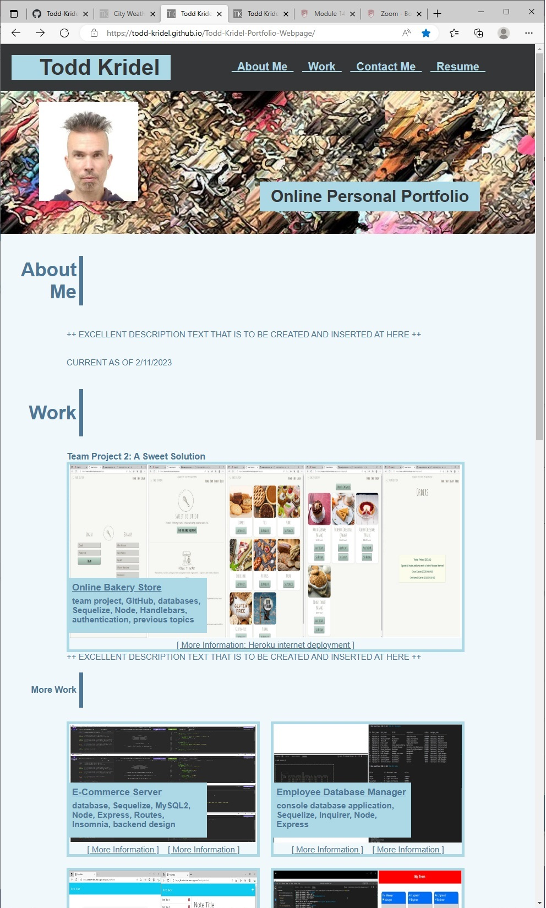

# Bootcamp Module 2 Challenge Assignment -- a Personal Professional Portfolio website system for keeping records of bootcamp accomplishements and achievements

## Description

This assignment -- a Personal Professional Portfolio website -- which was for the Module 2 Challenge of the DU Coding Bootcamp -- was done for the purpose of furthering the more-advanced (or rather just-beyond-basic) CSS concepts and commands that are a good foundation to the full-stack (front-end and back-end) development of webpage systems. This assignment...similar to the previous Module 1 assignment...was an another good extension of the learned knowledge of the "Prework Study Guide" tool assignment that was done for an initiation for the 1st bootcamp class. The study guide tool can be accessed and viewed through a link that is contained on this portfolio website. This portfolio website assignment will be an on-going project throughout the remaining time of the bootcamp and then for months or even years at afterward...for maintaining a good collection and display space of information about personal professional coding experience and achievements. That information will be very helpful and effective for seeking professional coding employment opportunities or/and computer-related hobby/charity opportunities.

This current Module 2 Challenge assignment provided a good mechanism for examining and analyzing and understanding and then designing the external-file Cascading Style Sheets (CSS) -- design appearance -- code of a webpage that had to be written entire from blank starter files; and also the assignment was a good mechanism for viewing and learning about and processing the corresponding HTML components that are in the definition code file of the webpage (which also had to be written from a blank file). And then the learned knowledge allowed for the webpage system to be improved and expanded by organizing the display elements with a more- complex and dynamic data-display structure that is call a "flexbox (or flex-box)".

This assignment provided continued focussed on the concepts/objectives of "Accessibility" and "Responsiveness"...which is for adding efficiencies and enhancements that assist users who cannot access or see certain display/interactive features of the website; and adding efficiencies and enhancements that assist with the versatility of the display functions of a website (for different capabilities of different connecting devices (screens and printers)). The situation of users being not able to access or see display/interactive features of a website can occur during connection problems or when the user has a sight disability or hearing disability. The learning of the assignment is good information for creating webpage systems that are more-user-friendly and are more-efficient by being optimized for usage with many different display devices and print devices.

----

The objectives -- user story and acceptance criteria items -- of the assignment were as follows:

[ User Story ]

AS AN employer
I WANT to view a potential employee's deployed portfolio of work samples
SO THAT I can review samples of their work and assess whether they are a good candidate for an open position

[ Acceptance Criteria ]

Here are the critical requirements necessary to develop a portfolio that satisfies a typical hiring manager's needs:

GIVEN I need to sample a potential employee's previous work
=
WHEN I load their portfolio
* THEN I am presented with the developer's name, a recent photo or avatar, and links to sections about them, their work, and how to contact them

WHEN I click one of the links in the navigation
* THEN the UI scrolls to the corresponding section

WHEN I click on the link to the section about their work
* THEN the UI scrolls to a section with titled images of the developer's applications

WHEN I am presented with the developer's first application
* THEN that application's image should be larger in size than the others

WHEN I click on the images of the applications
* THEN I am taken to that deployed application

WHEN I resize the page or view the site on various screens and devices
* THEN I am presented with a responsive layout that adapts to my viewport

[ Additional Grading Criteria ]

Also good coding practices and good GitHub/Git repository configuration.

## Installation

Make sure that you have a GitHub membership and account to be able to view the repository of the assignment webpage system. The published GitHub Pages view of the website should be accessible on the public internet access URL without a need to have a GitHub membership/account.

## Usage

To use this sample in-progress personal professional portfolio webpage system that will be added to and enhanced throughout the remaining months of the involved bootcamp class program...

1. Click the menu/section links to test about their functionality; 
2. Point to the pictures and the tab title of the webpage (and pause for a moment at each pointing) to view HTML alt/alternate text that describes the pictures to users of the webpage during situations when the pictures/icons cannot be displayed;
3. Attempt to resize the browser window to change the display size of the webpage to test about the versatility of the layout content of the webpage where the layout should change to a different view that does not interfere with readability.

The following picture shows the appearance of the current appearance of the in-progress webpage:

The following URL is for the GitHub Pages published public view of Todd Kridel's Personal Professional Portfolio assignment webpage: "https://todd-kridel.github.io/Todd-Kridel-Portfolio-Webpage/".

## Credits

NA

## License

MIT License

Copyright (c) 2022 DU Full-Stack Web Development Coding Boot Camp

Permission is hereby granted, free of charge, to any person obtaining a copy
of this software and associated documentation files (the "Software"), to deal
in the Software without restriction, including without limitation the rights
to use, copy, modify, merge, publish, distribute, sublicense, and/or sell
copies of the Software, and to permit persons to whom the Software is
furnished to do so, subject to the following conditions:

The above copyright notice and this permission notice shall be included in all
copies or substantial portions of the Software.

THE SOFTWARE IS PROVIDED "AS IS", WITHOUT WARRANTY OF ANY KIND, EXPRESS OR
IMPLIED, INCLUDING BUT NOT LIMITED TO THE WARRANTIES OF MERCHANTABILITY,
FITNESS FOR A PARTICULAR PURPOSE AND NONINFRINGEMENT. IN NO EVENT SHALL THE
AUTHORS OR COPYRIGHT HOLDERS BE LIABLE FOR ANY CLAIM, DAMAGES OR OTHER
LIABILITY, WHETHER IN AN ACTION OF CONTRACT, TORT OR OTHERWISE, ARISING FROM,
OUT OF OR IN CONNECTION WITH THE SOFTWARE OR THE USE OR OTHER DEALINGS IN THE
SOFTWARE.
